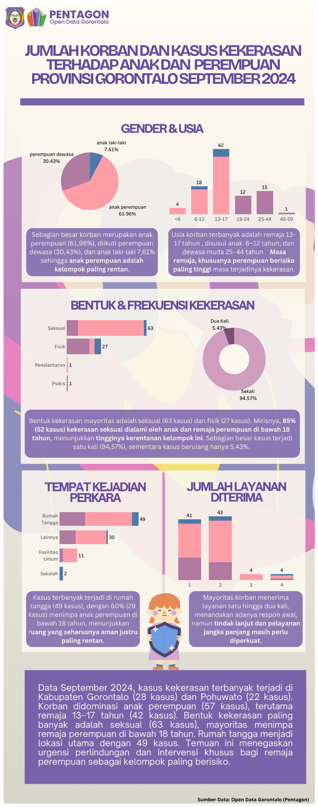
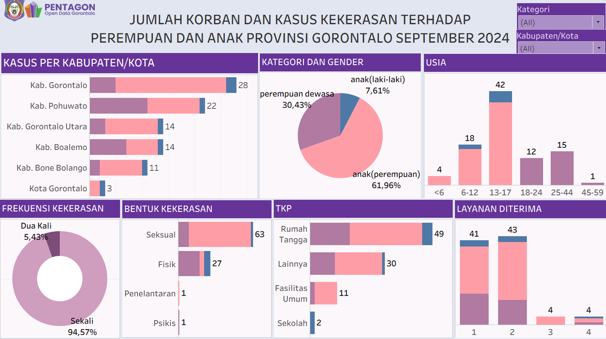

# Report: Jumlah Korban dan Kasus Kekerasan terhadap Perempuan dan Anak  
**Provinsi Gorontalo – September 2024**

This report analyzes the number of victims and cases of violence against women and children in Gorontalo Province, using **Open Data Gorontalo (Pentagon)** for the period of September 2024.

Data used in this report includes:  
- Kekerasan terhadap anak perempuan (KTA Perempuan)  
- Kekerasan terhadap anak laki-laki (KTA Laki-laki)  
- Kekerasan terhadap perempuan dewasa (KTP Perempuan)  

> **Note:** The dataset is aggregated (summary) and does not include microdata or primary keys. Therefore, the Tableau dashboard and infographic are not fully interactive, and filtering is limited to district/city and category.

---

## 🔑 Key Variables
- Gender  
- Age  
- Type of violence  
- Frequency of violence  
- Location of incident  
- Services received by victims  

Supporting variables (not visualized in the dashboard but used for analysis):  
- Relationship to perpetrator  

---

## 📊 Main Findings

1. **Distribution by District/City**  
   - Highest cases: Kabupaten Gorontalo (28 cases)  
   - Followed by: Pohuwato (22 cases)  
   - Lowest: Kota Gorontalo (3 cases)  

2. **Category & Gender of Victims**  
   - Child girls: 61.96%  
   - Adult women: 30.43%  
   - Child boys: 7.61%  

3. **Victim Age**  
   - Adolescents (13–17 years): 42 cases  
   - Children (6–12 years): 18 cases  
   - Young adults (25–44 years): 15 cases  
   - Most perpetrators were boyfriends/friends (38.6% of cases)  

4. **Type of Violence**  
   - Sexual violence: 63 cases  
   - Physical violence: 27 cases  
   - Neglect & psychological: 1 case each  
   - **52 sexual violence cases** involved under-18 girls  

5. **Frequency**  
   - One-time cases: 94.57%  
   - Repeated cases: 5.43%  

6. **Place of Incidents**  
   - Household: 49 cases (29 cases involved girls under 17)  
   - Only 10 cases were by parents or close family → further study needed  

7. **Victim Services**  
   - Most victims received services 1–2 times  
   - Need to strengthen long-term follow-up support  

---

## 📈 Visualizations

```


```
link to tableau public: 

```
https://public.tableau.com/views/KekerasanAnakdanPerempuanGorontalo2024/SIMPLEINFOGRAFIS?:language=en-US&publish=yes&:sid=&:redirect=auth&:display_count=n&:origin=viz_share_link
```


